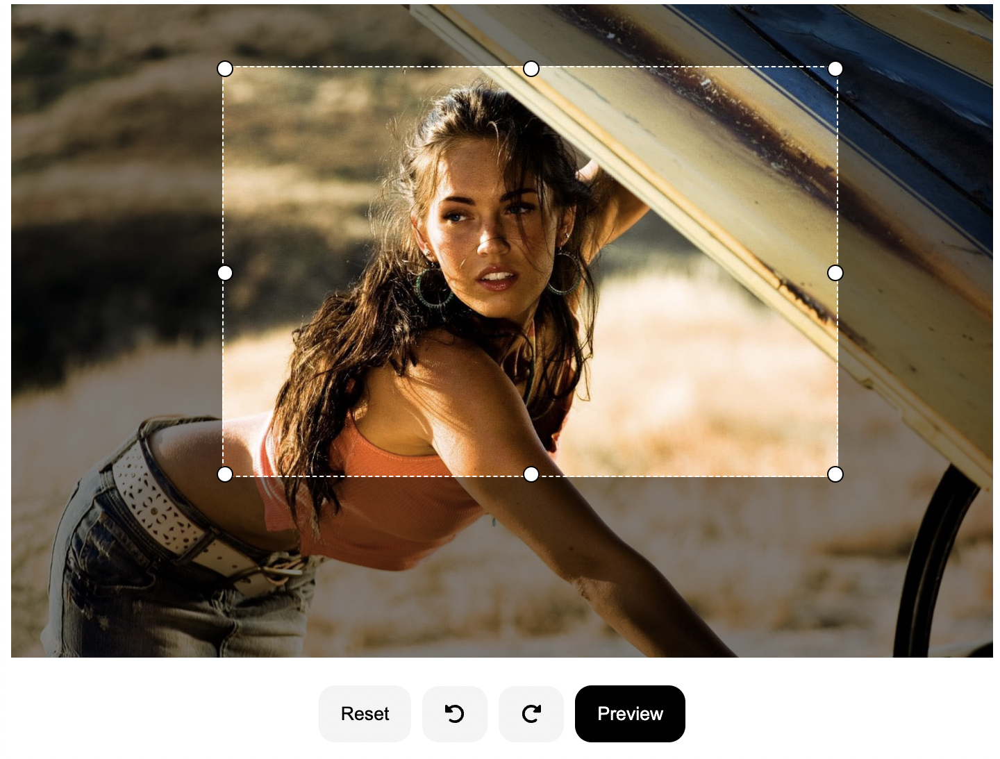

<p align="center">
  <a href="#" rel="noopener">
 </a>
</p>

<h2 align="center">React Image Edit</h2>

<div align="center">

[](#)
[](https://github.com/girishsawant999/image-edit-tool/issues)
[](https://github.com/girishsawant999/image-edit-tool/pulls)

[](https://github.com/girishsawant999/image-edit-tool/actions)
[](/LICENSE)

</div>

---

<p align="center"> A react npm package to crop, rotate & resize image before saving or upload.
    <br> 
</p>

<p align="center">
  <a href="https://girishsawant999.github.io/image-edit-tool/" target="_blank">
    React Image Edit Playground
  </a>
</p>

## 📝 Usage

Just install the package using command

```
npm install @girishsawant999/react-image-edit
```

And then import component in your react app

```javascript
import ImageEditor from '@girishsawant999/react-image-edit';

// Use ImageEditor Component

<ImageEditor src={defaultURL} onSave={(url): void => setUrl(url)} saveButtonText="Preview" />;
```

That's all and you are ready to go.

## 📃 Props

| Prop               | Types                     | Description                                                                   |
| ------------------ | ------------------------- | ----------------------------------------------------------------------------- |
| src                | string                    | An image source url                                                           |
| onSave             | (url: string) => void     | A callback function on save button click gives you updated image url          |
| maxWidth           | number <br> Default: 600  | Final resize width for updated image height will be according to aspect ratio |
| saveButtonText     | string <br> Default: Save | Button text for final save update                                             |
| containerClassName | string                    | Classes for container                                                         |
| imgClassName       | string                    | Classes for Image tag                                                         |
| toolbarClassName   | string                    | Classes for toolbar div                                                       |
